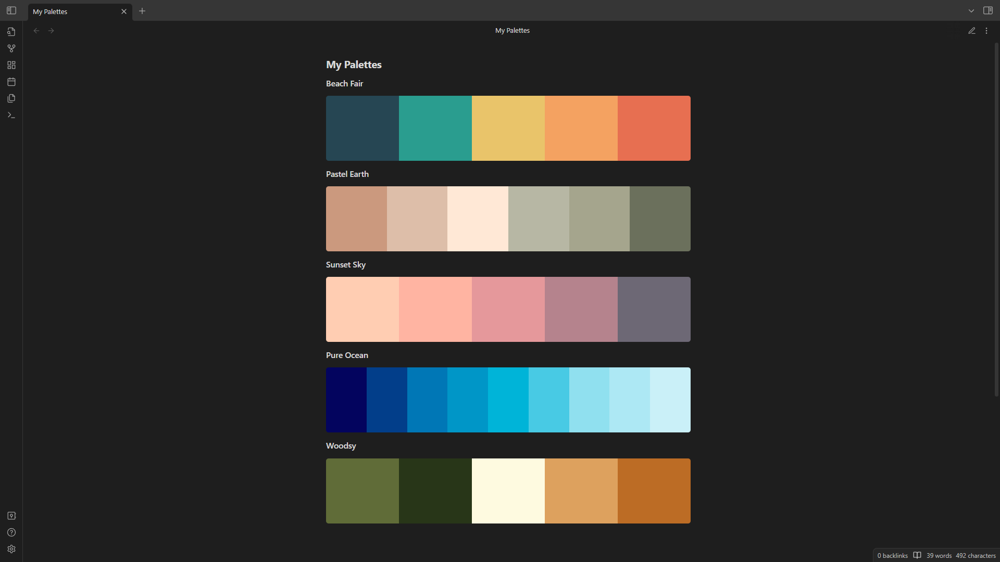

# Color Palette

Create beautiful & functional color palettes that enhance the appearance of your notes.



## Key Features
- Create color palettes from popular palette websites like coolors & colorhunt.
- Convert links already present within your notes into palettes.
- Easily copy the hex code of a color by selecting it.

## Usage

Palettes can be created manually by adding a codeblock with the hex codes desired.\
*Currently only supports hex values.*

<pre>
```palette
#ffffff
#000
```
</pre>

Palettes can also be created from links.\
*Only URLs from https://coolors.co & https://colorhunt.co are currently supported.*

<pre>
```palette
https://colorhunt.co/ffffff
```
</pre>

### Commands
Commands can be bound to a hotkey in settings.

- Insert Link - Creates a new palette from a URL
- Convert Link - Converts a selected URL to a palette